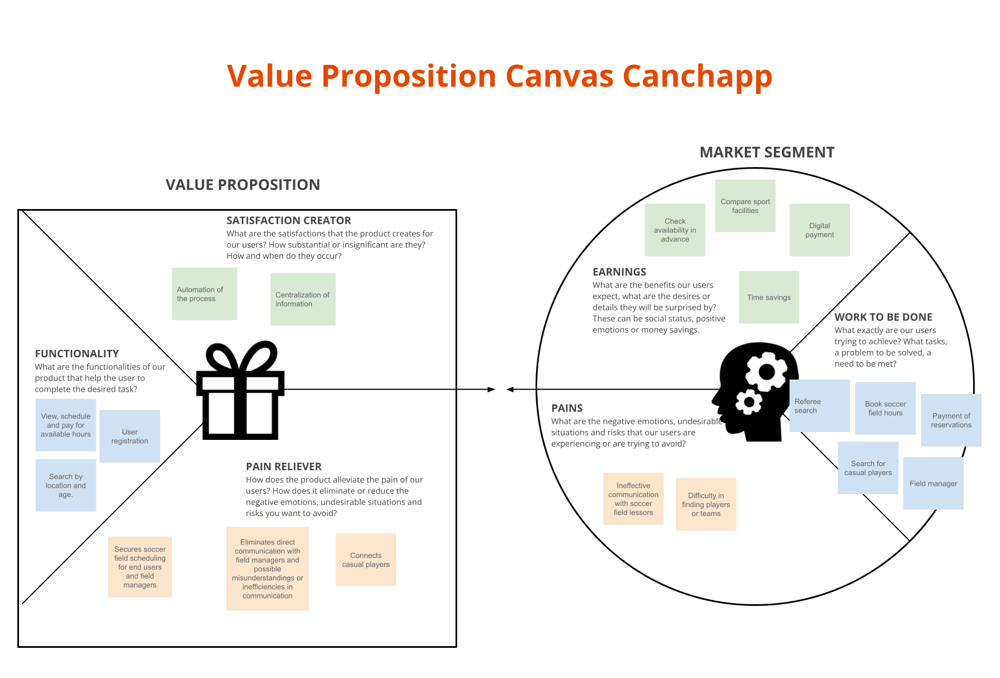
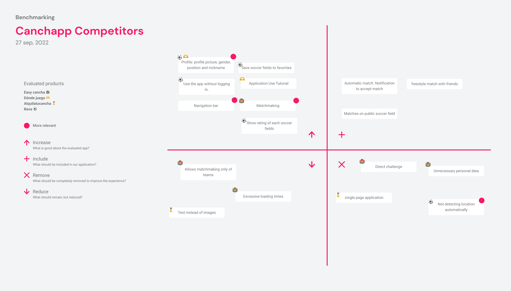
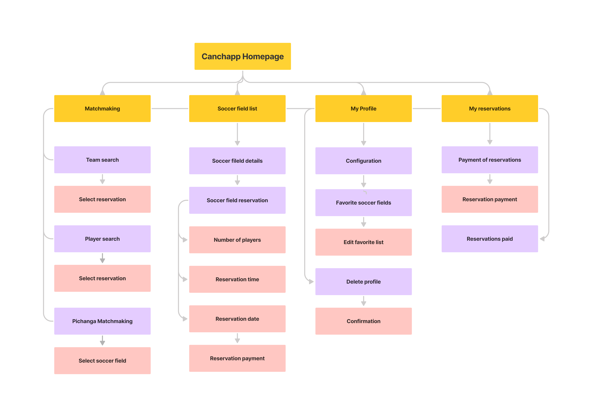

# Canchapp UXD
User experience design process for Canchapp - Book sports venues and invite your friends to play in one place

## Authors and acknowledgment
- [Francisca Rivas](https://github.com/PanchiAnubis) - Designer
- [Esteban Esparza](https://github.com/Esteb4nx) - Designer
- [Gabriel Aillapán](https://github.com/GabeASM) - Analyst
- [Jorge Mainhard](https://github.com/jmainhard) - Project Manager

## Description
The purpose of this project is to be an educational and application instance of user experience design learning.

The problem to be solved is the decentralization and difficult access to sports venues rental that recurrent
users of these places suffer, having to use different tools for payment, communication, etc., in order to access to the services. 
Since this project corresponds exclusively to user experience design and its elements, the strategy, scope, structure, skeleton and surface are described in this document.
All of the above is focused on a mobile application for casual soccer players.

___

## Strategy
The first step undertaken by the team is to articulate the strategy. A "Value Proposition Canvas" is used as a way to compare canchapp and the potential solution to the customer's need.

This process led us to understand our market segment and relate it to a value-adding proposition. From the previous figure it is worth indicating some elements observed such as "Payment of reservations" and its counterpart in "Functionality", "View, schedule, and pay for available hours" this allows us to better understand our product in the terms described above. There are also other elements that were of initial consideration such as the search for referees, which would eventually be discarded by the team.

---

## Scope
After defining a product strategy it is important to define a scope. In this section we create a profile of our ideal customer and visualize how our product will work for them.

We define how to meet the strategic objectives defined in the previous section. These are converted into requirements through the benchmark canvas.

[Benchmark canvas: Full document here](deliverables/BenchmarkCanvas.pdf)

---

## Structure

---

## Skeleton
Wireframes
- [Full document here](deliverables/Wireframes.pdf)

---

## Surface

Mockups
- [Full document here](deliverables/Mockups.pdf)

